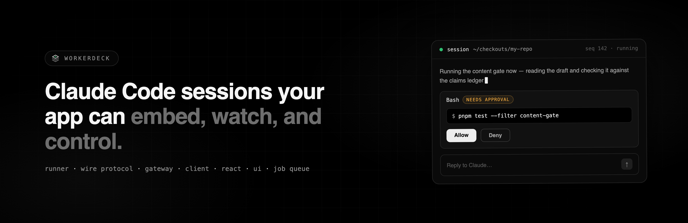

<p align="center">
  
</p>

# WorkerDeck

<p>
  <a href="https://github.com/workerdeck/workerdeck/actions/workflows/ci.yml"></a>
  <a href="https://www.npmjs.com/package/workerdeck"></a>
  <a href="LICENSE"></a>
  <a href="https://workerdeck.github.io/workerdeck/"></a>
  = 22" />
</p>

**Claude Code sessions your app can embed, watch, and control.** WorkerDeck runs a
close-to-real Claude Code session via the
[Anthropic Agent SDK](https://code.claude.com/docs/en/agent-sdk) and puts a session server, a
typed wire protocol, and an approve/deny UI around it — so a browser can drive an agent working
in a real checkout.

## Run it

```bash
npx workerdeck
```

Gateway **and** dashboard on one port at `http://127.0.0.1:8787` — nothing to clone, no config.
Point a session at a project directory, give it a prompt, watch the transcript stream, approve or
deny the tool calls it wants to make.

```bash
# Reachable, protected, and scoped to a directory tree:
npx workerdeck --host 0.0.0.0 --auth-key "$SECRET" --cwd-root ~/projects
```

`--auth-key` is one secret over two transports: browsers get a login page and an `HttpOnly`
cookie, services send the same secret as `x-workerdeck-key`. Off loopback without a key, the
instance generates one rather than serving open — printed once, kept in `<state-dir>/auth-key`,
reused across restarts. Options that are *functions* — `authenticate`,
`buildRunnerConfig`, `createEngineRunner` — go in a `workerdeck.config.mjs`
([example](examples/workerdeck.config.mjs)). Full flag surface:
[Run an instance](https://workerdeck.github.io/workerdeck/docs/getting-started/run-an-instance/).

**Docs: [workerdeck.github.io/workerdeck](https://workerdeck.github.io/workerdeck/)** —
quickstart, embedding, permissions, profiles, job queue, protocol reference.

## What it actually gives you

- **Close-to-real sessions.** Same skills (`.claude/skills/`), same `CLAUDE.md`, same MCP surface,
  same permission system as Claude Code launched in that directory.
- **Human-in-the-loop permissions.** A tool call not covered by the session's permission mode
  becomes a pending approval; the tool blocks until someone decides, deny-on-timeout by default.
  This is what makes it safe to point at a real checkout.
- **Attach, replay, resume.** One ordered stream of seq-numbered events. Clients reconnect and
  replay from their last seen seq; closed sessions resume from the SDK's on-disk store with the
  prior transcript backfilled.
- **Three engines on one protocol.** Claude Code, **OpenAI Codex** (the codex CLI, driven the
  same way the Agent SDK drives Claude Code), or any provider the [AI SDK](https://ai-sdk.dev)
  supports through a host hook — same client, same panel, same queue. Clients render from each
  engine's **capability record**, so an affordance an engine lacks is hidden, never a control
  that silently does nothing.
- **Unattended runs.** A job queue with bounded concurrency, token budgets, retries, a wall-clock
  watchdog, and webhooks.
- **Work that outlives the turn.** A session can park on something nothing here is doing — a batch
  job, a human approving on Monday — and wake days later, mid-turn, as itself.
- **The host's files, in the trees sessions already run in.** `/v1/fs` serves browse, read and
  fuzzy search over your `--cwd-root` directories — a remote client gets a real file tree instead
  of guessing at paths. Reading needs no extra grant (you could already have the agent print those
  files); `--fs-write` opts into saving, which is the part a `PUT` wouldn't otherwise ask
  permission for.

## Embed it in your app

```ts
import { createWorkerServer } from '@workerdeck/server'

const worker = createWorkerServer({
  authenticate: async (req) => verifyMyAppToken(req.headers.authorization),
  allowedCwdRoots: ['/srv/checkouts'],
  buildRunnerConfig: (req) => ({ ...req, env: { ...process.env } }),
})
await worker.listen(8787)
```

```tsx
import { WorkerDeckClient } from '@workerdeck/client'
import { SessionPanel } from '@workerdeck/ui' // Tailwind v4 host: see packages/ui/README.md

const client = new WorkerDeckClient({ baseUrl: 'https://my-app/worker/v1', headers: { … } })
const session = await client.createSession({
  cwd: '/srv/checkouts/my-repo',
  prompt: '/verify-content 42',
  settingSources: ['user', 'project'], // pick up the repo's skills + CLAUDE.md
})
// then render:
<SessionPanel client={client} sessionId={session.id} />
```

There's a rung for every level of control: the styled `SessionPanel`, the headless
`useClaudeSession` hook, the raw event stream (`client.attach(id).on('event', …)`), or
`SessionRunner` from `@workerdeck/core` in-process with no server at all. See the
[embedding guide](https://workerdeck.github.io/workerdeck/docs/guides/embedding/).

## Three engines: Claude Code, Codex, and any provider

A **profile** is what a session runs as — and it picks the engine. The default is Claude Code via
the Agent SDK. `engine: 'codex'` runs OpenAI Codex the same way — the local codex binary driven
over its `app-server` JSON-RPC surface, streaming token-by-token, resolving its own auth
(`codex login` in your terminal) exactly as the Claude CLI resolves its own. `engine: 'provider'`
runs the model-agnostic engine through a host hook: no CLI process, any AI SDK provider.

```ts
createWorkerServer({
  profiles: [
    { name: 'ada', configDir: '/home/ada/.claude' },                 // Claude Code
    { name: 'codex', engine: 'codex' },                              // OpenAI Codex (~/.codex)
    {
      name: 'kimi',
      engine: 'provider',
      // apiKeyEnv is a variable NAME. No credential is stored here or put on the wire.
      provider: { id: 'moonshotai', model: 'kimi-k3', apiKeyEnv: 'MOONSHOT_API_KEY' },
      session: { capabilities: ['web_fetch', 'deliver_file'], mcpServers: ['deepwiki'] },
    },
  ],
  // Provider profiles only — the one place a model SDK and its credentials are resolved
  // (claude and codex ship as in-repo adapters and need no hook). May be async.
  createEngineRunner: ({ config, profile, bridge }) => createEngineSession({ /* … */ }),
})
```

Every profile answers `GET /profiles` with its engine's **capability record** (approvals, modes,
resume, telemetry, attachments, reasoning efforts…), a **model catalog** shipped with the release
— a real picker from the first request, no warm-up session — and whether its credentials
currently **probe as usable** (`available`, with an actionable reason when not; display-only, so
a stale probe can never block a create). Codex approvals are wired to the same permission
surface as Claude's: the binary's ask channels (command escalations, file changes, permission
grants, questions, MCP elicitations) arrive as pending approvals and are answered from any
client — with one semantic difference carried honestly in the request itself: a codex command
approval is usually an *escalation after its sandbox already refused the command* ("command
failed; retry without sandbox?"), not a gate before execution, and approving re-runs it
unsandboxed. Permission modes map onto the codex sandbox + ask policy (`default` → read-only,
blocked actions ask; `acceptEdits` → workspace-write, escalations ask; `bypassPermissions` →
full access, asks nothing).

The provider engine trades ambient authority for a sandbox:

- **Capability-scoped tools.** No shell, no host filesystem. `fs_*` operate on an in-memory
  scratch VFS; `web_search`, `download`, `web_fetch` and `deliver_file` exist only when the
  profile grants them, and a session request may narrow that set but never widen it.
- **Untrusted code runs in QuickJS — possibly not on your machine.** `eval_script` is the one
  *sandboxed* tool, and it can execute in the **user's own browser tab** over the WS bridge, so
  client-held documents never reach the server. Everything else is *authoritative*: server-side,
  server credentials, never bridged. The split is enforced in types.
- **Different vocabulary, honestly.** A provider session runs `default`, `bypassPermissions` and
  `dontAsk`; asking for `acceptEdits`/`plan`/`auto` is a 400 rather than a silent coercion. The
  model list is whatever the operator declared, and CLI-only affordances (resumable SDK sessions,
  context/rate-limit telemetry, setting sources) simply don't exist — the dashboard hides them,
  keying off the capability record on `ProfileInfo`/`SessionInfo`.

All engines implement one `Runner` interface and speak the same protocol, so client, React layer,
panel and queue are unchanged either way. Profiles also scope *who may run as what*:
`allowedProfiles` on the authenticate principal, because each person under their own profile is
each person using their own account. See
[Profiles](https://workerdeck.github.io/workerdeck/docs/guides/profiles/).

## Unattended runs, and runs that park

```ts
createWorkerServer({
  authenticate,
  queue: {
    maxConcurrency: 2,          // concurrent job sessions
    sessionTokenLimit: 200_000, // tokens per job (input+output+cache); exceeding kills the run
    dailyTokenLimit: 2_000_000, // global budget per UTC day; queued jobs held once exhausted
    maxJobDurationMs: 1_800_000,          // wall-clock watchdog against a wedged CLI
    retention: { maxAgeMs: 86_400_000 },  // expire terminal jobs
  },
})
```

```ts
const job = await client.createJob({
  session: { cwd: '/srv/checkout', prompt: '/verify-content 42' },
  webhook: { url: 'https://my-app.test/hooks/claude', headers: { authorization: '…' } },
  attempts: 3, // failed (not canceled) runs re-queue with exponential backoff
})
```

A job is one unattended run, executing as an ordinary registry session — so the dashboard watches
it stream live. `job_started` → `job_progress` → `job_completed` reach the webhook, or stream the
whole queue over `/v1/queue/ws`.

When a tool call can't answer in the next few seconds, the session **parks**: it snapshots, the
runner is torn down, and the run resumes when the result arrives — same id, same transcript, same
seq numbering, mid-turn.

```ts
selectExecutor: () => new DeferredExecutor({
  timeoutMs: 86_400_000,                             // watchdog; a timeout reaches the agent as tool output
  onDispatch: (call) => enqueueForYourWorkers(call), // call.executionId is the callback address
})
```

```bash
# Whenever the work is done — minutes or days later:
curl -X POST $SERVER/v1/executions/$EXECUTION_ID/result \
  -H 'content-type: application/json' \
  -d '{"status":"ok","output":{"type":"json","value":{"rows":128}}}'
```

A parked job frees its concurrency slot and stops its wall-clock budget, so one worker can have a
hundred runs waiting on the world and still only run three at a time. Failed results (the
watchdog's timeout included) are ordinary tool output the agent adapts to, not a crashed session,
and delivery is idempotent by `executionId`. `npx workerdeck` parks durably under
`~/.workerdeck` by default; embedded hosts opt in with
`parking: { store: createFileSessionStore({ dir }) }` — that directory holds whole transcripts in
plaintext, so treat it like `~/.claude/projects`, not like a cache.

A restart is still not free: a turn in flight dies with the process, as does a pending approval.
`workerdeck guard` asks a live instance whether anything would be lost and exits non-zero while
the answer is yes:

```bash
npx workerdeck guard --wait 300 --allow-parked && systemctl restart workerdeck
```

## Reaching a person who isn't watching

A session blocked on an approval is useless if nobody is looking at it, and the live WebSocket
only helps someone who has one open. `notifications` POSTs the four moments a human acts on —
permission requested, turn finished, error, closed — to a URL you control:

```ts
const worker = createWorkerServer({
  authenticate,
  notifications: {
    webhook: { url: 'https://my-app.test/hooks/session', headers: { authorization: '…' } },
    // events: ['permission_requested'],  // default: all four
  },
})
```

Server-wide, unlike the queue's per-job webhook: the point is hearing about sessions you neither
created nor are attached to. `permission_requested` carries the whole request, so a consumer can
answer it over REST (`POST /v1/sessions/:id/permissions/:requestId`) — which is what makes an
Approve button in a chat message, or on a phone's lock screen, work. The server itself holds no
push credentials and knows nothing about APNs or Slack; it speaks HTTP to your URL.

## Packages

Two tiers: `@workerdeck/*` are the libraries you embed, `workerdeck` is the instance you
run. Each package has its own README.

| Package | What it is |
| --- | --- |
| [`workerdeck`](packages/cli) | The turnkey instance: gateway + dashboard on one port, shared-secret auth, durable parking, restart guard. |
| [`@workerdeck/protocol`](packages/protocol) | The wire protocol — events, commands, REST shapes. Dependency-free, browser-safe. **The product boundary**, versioned from day one. |
| [`@workerdeck/core`](packages/core) | The engines, as adapters: `SessionRunner` (Agent SDK), `CodexRunner` (the codex binary over JSON-RPC; `@openai/codex` an optional peer) and `AiSdkRunner` (any provider) behind one `Runner` interface — each with a capability record, a shipped model catalog and a credential probe — plus tool execution on a swappable `ToolExecutor` seam and `park()`/`restore`. No transport. |
| [`@workerdeck/sandbox`](packages/sandbox) | The untrusted-code boundary: QuickJS-NG WASM guest, in-memory scratch VFS, by-value host bridge, interpreter-enforced memory and time limits. Runs server-side or in a tab. |
| [`@workerdeck/queue`](packages/queue) | The job queue: concurrency, token budgets, retries, watchdog, retention, webhooks. Pluggable `QueueAdapter` (in-memory bundled). |
| [`@workerdeck/server`](packages/server) | The gateway: HTTP + WebSocket, session registry, auth hook, profiles, job routes, session notifications, browser tool bridge, parked-session storage, opt-in host-file routes. |
| [`@workerdeck/client`](packages/client) | Typed client for browsers and Node: REST + WS attach with auto-reconnect and replay-from-last-seq. Zero runtime deps. |
| [`@workerdeck/react`](packages/react) | Headless React: `useClaudeSession`, attachment/host-file hooks, and a pure transcript reducer. No styling opinion. |
| [`@workerdeck/ui`](packages/ui) | Styled agent-control components: session panel (transcript, tool-call cards, permission prompts, composer with attachments and `@file`/`/command` completion, plus the context / usage / MCP / project-file panels). Tailwind v4 + Base UI + cva. |
| [`@workerdeck/web`](packages/web) | The dashboard as prebuilt static files, for serving from your own host. Zero runtime deps. |

## Auth & Anthropic's terms

**WorkerDeck performs no Anthropic authentication of its own — by design.** It spawns the
official Agent SDK, which spawns the official CLI, which resolves whatever credentials the
*operator's* environment provides: `ANTHROPIC_API_KEY`, Bedrock/Vertex, or the operator's own
stored `claude login`. It never implements claude.ai OAuth, never reads, stores or proxies tokens,
and never touches `~/.claude` credentials.

Our good-faith reading, not legal advice: **an API key (or Bedrock/Vertex) is the supported path**
for anything that is a service — unattended runs, multi-user deployments, anything you expose to
others — because Anthropic's Agent SDK docs are explicit that third-party developers may not offer
claude.ai login or subscription rate limits in their products. Set `ANTHROPIC_API_KEY` and use
`requireApiKey: true` to **fail closed** on subscription credentials. Your own subscription for
your own single-user use (the equivalent of running `claude -p` yourself) is the one case where
those may be appropriate; the server allows it with a one-time notice, and every session reports
its provenance as `apiKeySource`. **The compliance and legal posture of this project is still
under review** — with our own specialists and, where appropriate, Anthropic — so do your own
diligence. [Full discussion](https://workerdeck.github.io/workerdeck/docs/guides/auth/).

**Red lines for contributors** (PRs crossing these are rejected): no claude.ai OAuth flows or
login UI, no extraction/storage/forwarding of subscription tokens, no spoofing of Claude Code's
client identity, no multi-account pooling or rate-limit circumvention. The auth layer stays 100%
Anthropic-owned code.

## Honest constraints

- **No serverless.** The SDK spawns the CLI as a long-running subprocess with filesystem state.
  Realistic targets: a VM, a container with min-instances, any Node ≥22 host with a real disk.
- **Sessions are single-host.** Transcripts live on the server's local disk; resume works across
  restarts on the same host via `resume: sdkSessionId`.
- **The server trusts its host app.** For Claude sessions `CreateSessionRequest` accepts
  `mcpServers` and tool policy — gate creation behind your own auth and clamp with
  `allowedCwdRoots` + `buildRunnerConfig`. (Provider sessions are tighter by construction: MCP is
  declared on the profile, never by the caller.)
- **Parking is single-host either way.** The file store survives a restart, but two servers over
  one directory would race to rebuild the same sessions.

## Contributing

```bash
pnpm install
pnpm server   # gateway + dashboard on http://127.0.0.1:8787, no auth (loopback only!)
pnpm web      # optional: vite dashboard on :5191 with HMR, proxying /v1 to the gateway

pnpm typecheck   # tsgo (TypeScript 7 native preview)
pnpm test        # vitest — core runner, server integration, transcript reducer
pnpm lint        # oxlint
```

Dev never builds: apps and tests resolve packages straight to TS source via the
`@workerdeck/source` export condition, and `build/` exists only for publishing. Start with
[`docs/ARCHITECTURE.md`](docs/ARCHITECTURE.md) for the package map and dependency rule, and
[`docs/GOTCHAS.md`](docs/GOTCHAS.md) for the invariants that bite.
[`CONTRIBUTING.md`](CONTRIBUTING.md) has the rest; security reports go through
[`SECURITY.md`](SECURITY.md), not public issues.

## Status

**0.7.0** — early but real. Both engines, the protocol, server, client, headless React layer,
styled UI, dashboard, job queue, sandbox, and deferred execution are all in and tested. 0.5 added
the turnkey `npx workerdeck` instance, the dashboard as a published package, and durable parks;
0.6 added server-wide session notifications and was the first release under this name — the
project published as `claude-worker` / `@claude-worker/*` through 0.5, and those packages remain
on npm, deprecated and frozen there. 0.7 adds the host-filesystem routes (`/v1/fs`) and, alongside
them, the iOS remote's file browser and APNs push. Both of those last two are covered by tests but
have not yet been exercised against a live gateway from a physical phone — treat them as new, not
as settled. Expect the protocol to keep evolving — `PROTOCOL_VERSION` guards breaking changes and
is at 4. See the [roadmap](docs/ROADMAP.md) for what's next.

MIT © Tobias Strebitzer
