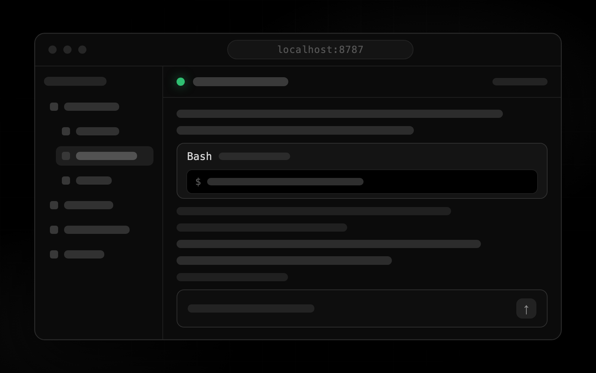
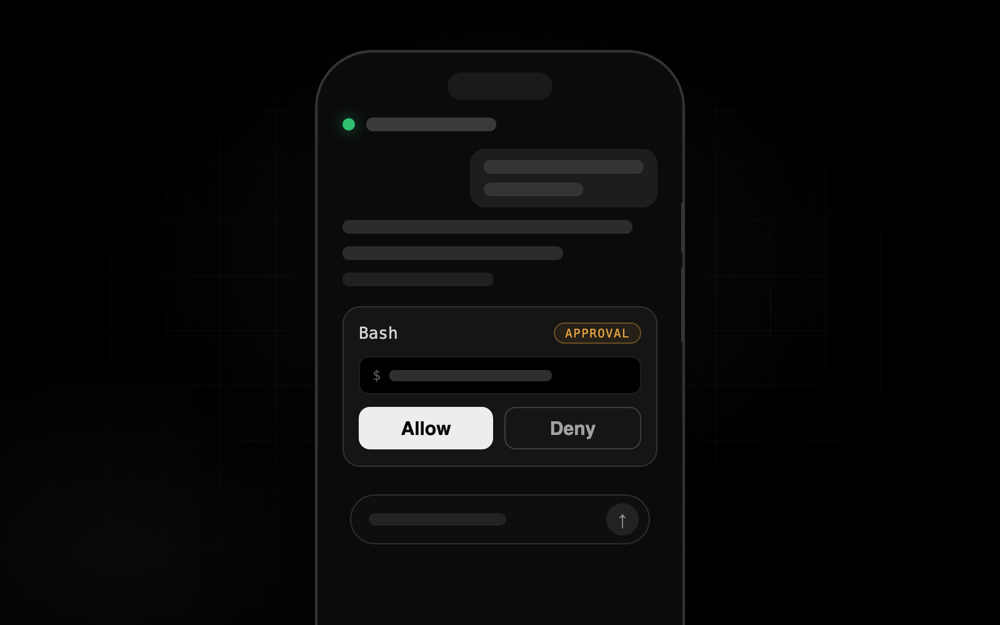
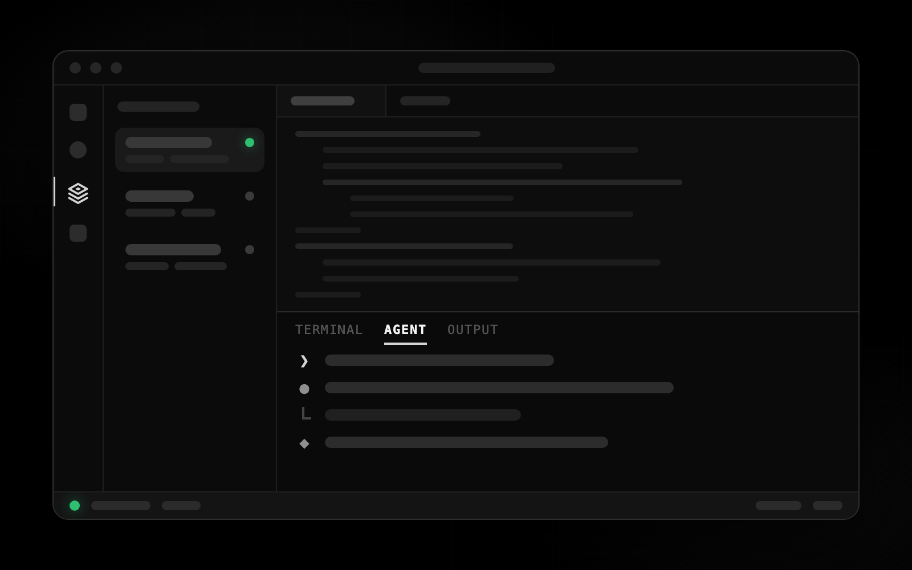
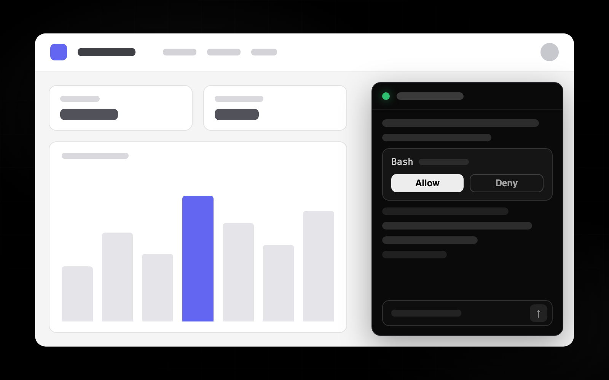
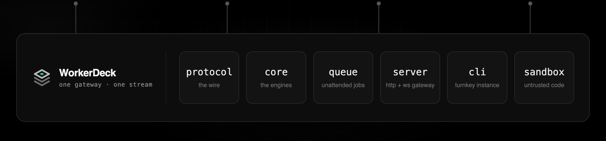

<p align="center">
  
</p>

# WorkerDeck

<p>
  <a href="https://github.com/workerdeck/workerdeck/actions/workflows/ci.yml"></a>
  <a href="https://www.npmjs.com/package/workerdeck"></a>
  <a href="LICENSE"></a>
  <a href="https://workerdeck.github.io/workerdeck/"></a>
  = 22" />
</p>

**Coding agent sessions you can watch, steer, and embed.** A coding agent — Claude Code, OpenAI
Codex, or any model provider — is a terminal program: it runs where you started it, and it is
yours only while that terminal is open. WorkerDeck puts a session server, a typed wire protocol
and an approve/deny UI around one, so the same session is reachable from a browser, your phone,
your editor, or an app you build yourself.

Self-hosted, MIT, and no credentials of its own: your agent's CLI resolves its own login exactly
as it does in your terminal.

## Quickstart

```bash
npx workerdeck
```

That is the whole install. Gateway **and** web dashboard on one port at `http://127.0.0.1:8787` —
nothing to clone, no config file. Open it, point a session at a project directory, give it a
prompt, and watch the transcript stream while you approve or deny the tool calls it wants to make.

To reach it from another machine — your phone on the same tailnet, say — bind it and give it a
secret:

```bash
npx workerdeck --host 0.0.0.0 --auth-key "$SECRET" --cwd-root ~/projects
```

`--auth-key` is one secret over two transports: browsers get a login page and an `HttpOnly`
cookie, services send the same secret as a header. Off loopback *without* a key the instance
generates one rather than serving open — printed once, kept in `<state-dir>/auth-key`, reused
across restarts. `--cwd-root` is what confines sessions to a directory tree.

**Docs: [workerdeck.github.io/workerdeck](https://workerdeck.github.io/workerdeck/)** — the full
flag surface, embedding, permissions, profiles, the job queue, and the protocol reference.

## One server, four ways in

The gateway is the base layer: it owns the sessions, the approvals and the event stream. Every
client above it is a view onto the same sessions — attach from three of them at once and they
stay in step, because there is one ordered, seq-numbered stream and everything replays from it.

<table>
  <tr>
    <td align="center" valign="top" width="25%">
      <a href="packages/web"></a>
      <br /><b><a href="packages/web">Web App</a></b>
      <br /><sub>The dashboard <code>npx workerdeck</code> already serves: file tree, Monaco editor, and the session panel with approvals, jobs and profiles.</sub>
    </td>
    <td align="center" valign="top" width="25%">
      <a href="apps/ios"></a>
      <br /><b><a href="apps/ios">iOS App</a></b>
      <br /><sub>Native SwiftUI remote for the gateways you run — every session in one list, approve or deny on the spot, APNs push to the lock screen.</sub>
    </td>
    <td align="center" valign="top" width="25%">
      <a href="apps/vscode"></a>
      <br /><b><a href="apps/vscode">VS Code Extension</a></b>
      <br /><sub>The session rides the bottom panel, terminal-shaped; gateways and sessions in the sidebar, approvals as native notifications, remote projects as a virtual workspace.</sub>
    </td>
    <td align="center" valign="top" width="25%">
      <a href="https://workerdeck.github.io/workerdeck/docs/guides/embedding/"></a>
      <br /><b><a href="https://workerdeck.github.io/workerdeck/docs/guides/embedding/">Embedded App</a></b>
      <br /><sub>The same panel, hooks and raw typed stream as libraries in your own product — the <a href="https://workerdeck.github.io/workerdeck/docs/guides/embedding/">embedding guide</a> walks the rungs.</sub>
    </td>
  </tr>
  <tr>
    <td colspan="4" align="center">
      <a href="packages"></a>
      <br /><sub><a href="packages/protocol"><code>protocol</code></a> · <a href="packages/core"><code>core</code></a> · <a href="packages/queue"><code>queue</code></a> · <a href="packages/server"><code>server</code></a> · <a href="packages/cli"><code>cli</code></a> · <a href="packages/sandbox"><code>sandbox</code></a></sub>
    </td>
  </tr>
</table>

## What it actually gives you

- **Close-to-real sessions.** A session behaves like the agent's own CLI launched in that
  directory: the same skills, the same project instructions, the same MCP surface, the same
  permission system.
- **Human-in-the-loop permissions.** A tool call not covered by the session's permission mode
  becomes a pending approval, and the tool blocks until someone decides — deny-on-timeout by
  default. This is what makes it safe to point at a real checkout.
- **Attach, replay, resume.** One ordered stream of seq-numbered events. Clients reconnect and
  replay from their last seen seq; a closed session resumes from the engine's own on-disk store
  with the prior transcript backfilled.
- **Three engines on one protocol.** Clients render from each engine's **capability record**, so
  an affordance an engine lacks is hidden rather than a control that silently does nothing.
- **Unattended runs.** A job queue with bounded concurrency, token budgets, retries, a wall-clock
  watchdog, and webhooks. A job is an ordinary registry session, so the dashboard watches it
  stream live.
- **Work that outlives the turn.** A session can park on something nothing here is doing — a batch
  job, a human approving on Monday — and wake days later, mid-turn, as itself. A parked run frees
  its concurrency slot and stops its wall-clock budget.
- **Reaching a person who isn't watching.** Server-wide webhooks for the four moments a human acts
  on (permission requested, turn finished, error, closed). The permission payload carries the
  whole request, so a consumer can answer it over REST — which is what makes an Approve button in
  a chat message, or on a phone's lock screen, work. The server itself holds no push credentials.
- **The host's files, in the trees sessions already run in.** Browse, read and fuzzy-search over
  your `--cwd-root` directories, so a remote client gets a real file tree instead of guessing at
  paths. Reading needs no extra grant; writing is a separate opt-in.

## Engines

A **profile** is what a session runs as, and it picks the engine.

- **Claude Code**, via the [Anthropic Agent SDK](https://code.claude.com/docs/en/agent-sdk).
- **OpenAI Codex** — the local `codex` binary, driven over its `app-server` JSON-RPC surface with
  token streaming and interactive approvals. Its ask channels map onto the same permission
  surface, with one difference carried honestly in the request itself: a codex command approval
  is usually an *escalation after its sandbox already refused the command*, not a gate before
  execution, and approving re-runs it unsandboxed.
- **Any provider** the [AI SDK](https://ai-sdk.dev) supports, through a host hook — no CLI
  process. This engine trades ambient authority for a sandbox: no shell, no host filesystem,
  capability-scoped tools, and untrusted code confined to a QuickJS guest that can run in the
  user's own browser tab so client-held documents never reach the server.

Every profile answers with its engine's capability record, a model catalog shipped with the
release (a real picker from the first request, no warm-up session), and whether its credentials
currently probe as usable. All three implement one `Runner` interface and speak the same
protocol, so the client, the React layer, the panel and the queue are unchanged either way.
Profiles also scope *who may run as what*, because each person under their own profile is each
person using their own account. See
[Profiles](https://workerdeck.github.io/workerdeck/docs/guides/profiles/).

## Packages

Two tiers: `@workerdeck/*` are the libraries you embed, `workerdeck` is the instance you run.
Each package has its own README, with the code for using it.

| Package | What it is |
| --- | --- |
| [`workerdeck`](packages/cli) | The turnkey instance: gateway + dashboard on one port, shared-secret auth, durable parking, restart guard. |
| [`@workerdeck/protocol`](packages/protocol) | The wire protocol — events, commands, REST shapes, and the few rules every client must agree on. Dependency-free, browser-safe. **The product boundary**, versioned from day one. |
| [`@workerdeck/core`](packages/core) | The engines, as adapters — each with a capability record, a shipped model catalog and a credential probe — behind one `Runner` interface, plus tool execution on a swappable seam and park/restore. No transport. |
| [`@workerdeck/sandbox`](packages/sandbox) | The untrusted-code boundary: QuickJS-NG WASM guest, in-memory scratch VFS, by-value host bridge, interpreter-enforced memory and time limits. Runs server-side or in a tab. |
| [`@workerdeck/queue`](packages/queue) | The job queue: concurrency, token budgets, retries, watchdog, retention, webhooks. Pluggable adapter (in-memory bundled). |
| [`@workerdeck/server`](packages/server) | The gateway: HTTP + WebSocket, session registry, auth hook, profiles, job routes, session notifications, browser tool bridge, parked-session storage, opt-in host-file routes. |
| [`@workerdeck/client`](packages/client) | Typed client for browsers and Node: REST + WS attach with auto-reconnect and replay-from-last-seq. Zero runtime deps. |
| [`@workerdeck/react`](packages/react) | Headless React: the session hook, attachment and host-file hooks, and pure reducers for the transcript and the sessions list. No styling opinion. |
| [`@workerdeck/ui`](packages/ui) | Styled agent-control components: the session panel (transcript, tool-call cards, permission prompts, composer with attachments and `@file` / `/command` completion), the sessions browser, and the workspace around them. Tailwind v4 + Base UI. |
| [`@workerdeck/web`](packages/web) | The dashboard as prebuilt static files, for serving from your own host. Zero runtime deps. |

The apps — [`apps/ios`](apps/ios), [`apps/vscode`](apps/vscode) and the
[docs site](apps/docs) — are not published to npm; each has its own README.

## Auth & the providers' terms

**WorkerDeck performs no model-provider authentication of its own — by design.** It spawns the
official SDK or CLI, which resolves whatever credentials the *operator's* environment provides.
It never implements a provider's OAuth flow, never reads, stores or proxies tokens, and never
touches a credential store. `codex login` is likewise your job, in your own terminal.

Our good-faith reading, not legal advice: **an API key (or Bedrock/Vertex) is the supported path**
for anything that is a service — unattended runs, multi-user deployments, anything you expose to
others — because Anthropic's Agent SDK docs are explicit that third-party developers may not offer
claude.ai login or subscription rate limits in their products. Set `ANTHROPIC_API_KEY` and use
`requireApiKey: true` to **fail closed** on subscription credentials. Your own subscription for
your own single-user use (the equivalent of running the CLI yourself) is the one case where those
may be appropriate; the server allows it with a one-time notice, and every session reports its
provenance. Whether OpenAI's terms restrict headless ChatGPT-subscription codex use the same way
is unresolved, and we take the same posture there. **The compliance and legal posture of this
project is still under review** — with our own specialists and, where appropriate, the providers
— so do your own diligence.
[Full discussion](https://workerdeck.github.io/workerdeck/docs/guides/auth/).

**Red lines for contributors** (PRs crossing these are rejected): no provider OAuth flows or login
UI, no extraction/storage/forwarding of subscription tokens, no spoofing of an official client's
identity, no multi-account pooling or rate-limit circumvention. The auth layer stays 100%
provider-owned code.

## Honest constraints

- **No serverless.** A CLI engine is a long-running subprocess with filesystem state. Realistic
  targets: a VM, a container with min-instances, any Node ≥22 host with a real disk.
- **Sessions are single-host.** Transcripts live on the server's local disk; resume works across
  restarts on the same host.
- **The server trusts its host app.** For CLI engines a create request accepts MCP servers and
  tool policy — gate creation behind your own auth and clamp it server-side. (Provider sessions
  are tighter by construction: MCP is declared on the profile, never by the caller.)
- **Parking is single-host either way.** The file store survives a restart, but two servers over
  one directory would race to rebuild the same sessions.
- **Neither app is in a store.** iOS and VS Code are built and side-loaded from this repo today.

## Contributing

```bash
pnpm install
pnpm server   # gateway + dashboard on http://127.0.0.1:8787, no auth (loopback only!)
pnpm web      # optional: vite dashboard on :5191 with HMR, proxying /v1 to the gateway

pnpm typecheck   # tsgo (TypeScript 7 native preview)
pnpm test        # vitest — core runner, server integration, transcript reducer
pnpm lint        # oxlint
```

Dev never builds: apps and tests resolve packages straight to TS source via the
`@workerdeck/source` export condition, and `build/` exists only for publishing. Start with
[`docs/ARCHITECTURE.md`](docs/ARCHITECTURE.md) for the package map and dependency rule, and
[`docs/GOTCHAS.md`](docs/GOTCHAS.md) for the invariants that bite.
[`CONTRIBUTING.md`](CONTRIBUTING.md) has the rest; security reports go through
[`SECURITY.md`](SECURITY.md), not public issues.

## Status

**0.12.0** — early but real. Three engines, the protocol, server, client, headless React layer,
styled UI, dashboard, job queue, sandbox and deferred execution are all in and tested. 0.9 landed
the engine adapters and the Codex engine; 0.10 added the session workspace and codex skills and
generated images; 0.11 published the VS Code extension; 0.12 rebuilt its navigation around native
editor chrome. The iOS app's APNs push is covered by tests but has not been exercised against a
live gateway from a physical phone — treat it as new, not as settled. Expect the protocol to keep
evolving: `PROTOCOL_VERSION` guards breaking changes and is at 7. See the
[roadmap](docs/ROADMAP.md) for what's next.

MIT © Tobias Strebitzer
